# OScript Language for Visual Studio Code

[][from the marketplace]
[](https://github.com/prantlf/vscode-oscript/actions)
[](https://david-dm.org/prantlf/vscode-oscript)
[](https://david-dm.org/prantlf/vscode-oscript#info=devDependencies)
[](./LICENSE)

Provides syntax checking and fixing, highlighting, autocompletion, hints, symbol outline, identifier recognition and renaming and other features for the [OScript language] in [Visual Studio Code].

## Installation

Install this extension to your Visual Studio Code [from the marketplace], or download a specific version of a [released package] and install it from the file.

## Features

Except for the first four features below, the others depend on the [OScript language server], which will be started in the background automatically.

* [Syntax Highlighting](#syntax-highlighting)
* [Scope Folding](#scope-folding)
* [Code Commenting / Uncommenting](#code-commenting-uncommenting)
* [Bracket Matching](#bracket-matching)
* [Syntax Checking](#syntax-checking)
* [Quick Fixes](#quick-fixes)
* [Autocompletion](#autocompletion)
* [Hints on Hover](#hints-on-hover)
* [Symbol Outline](#symbol-outline)
* [Definition and References](#definition-and-references)
* [Renaming](#renaming)

### Syntax Highlighting

The source code is broken down to tokens like keyword, identifier or literal, which are recognised by the highlighter. You just choose a visual theme to colourise them.

An example of the syntax highlighting in the Dark+ theme:

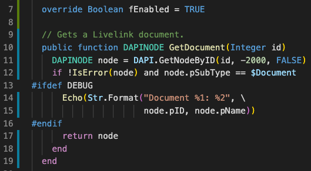

An example of the syntax highlighting in the Light+ theme:

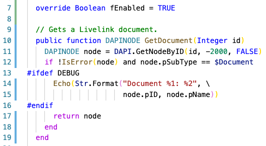

### Scope Folding

Foldable scopes are comments, preprocessor directive blocks, objects, scripts and functions. The scope-closing token (the `end` keyword, the `#else` or `#endif` directives, or the multiline-commend ending `*/`) will be included in the folded code.

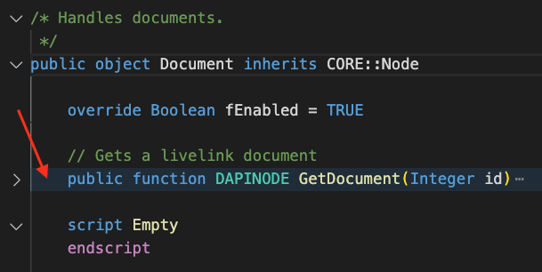

### Code Commenting / Uncommenting

Commands "Toggle Line Comment" (`Cmd+/`) and "Toggle Block Comment" (`Shift+Alt+A`) can be used to enclose a code block in a comment, or undo this operation.

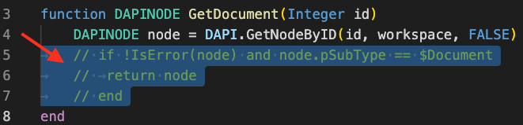

### Bracket Matching

Parentheses, square brackets and curly braces are recognised as pairs, so that you can navigate between them or emphasize them. You can make use of it using commands like "Go to Bracket" (`Shift+Cmd+\`) or extensions like [Bracket Pair Colorizer 2].

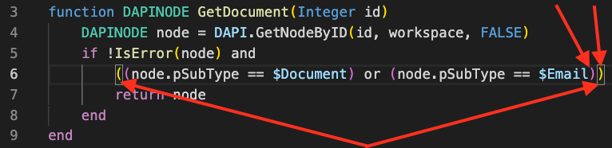

### Syntax Checking

Static source code analysis can point to syntax errors, which would make the later compilation fail. Parsing of the source code will stop after the first error is encountered. Problems that the compiler can recover from are reported as warnings.

You can see all problems in the Problems sidebar:

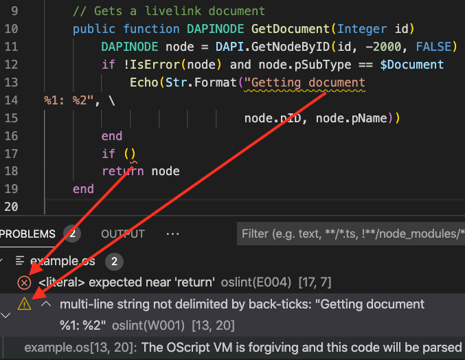

You can also show details about a problem that you focused in-place by the command "Peek Problem" (`Alt-F8`):

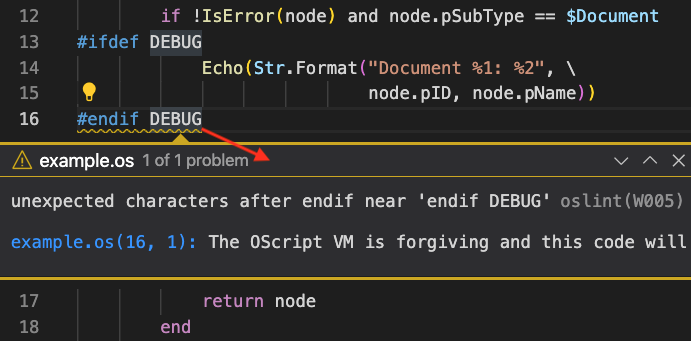

### Quick Fixes

Some problems encountered during the syntax check can be corrected automatically. They are reported as warnings. If you hover above the problem location, you will be able to click on "Quick Fix..." (`Cmd+.`):

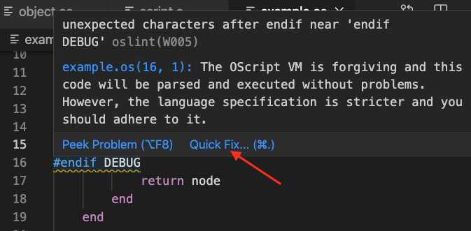

When executing the command, you will be able to pick a kind of the fix to perform on the source code:

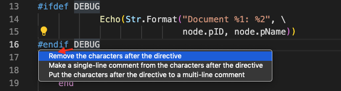

### Autocompletion

Autocompletion with details collapsed:

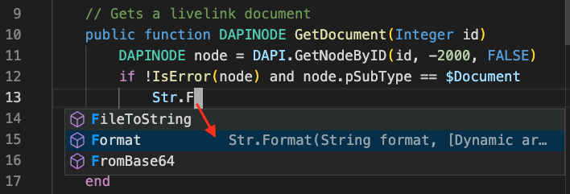

Autocompletion with details expanded:

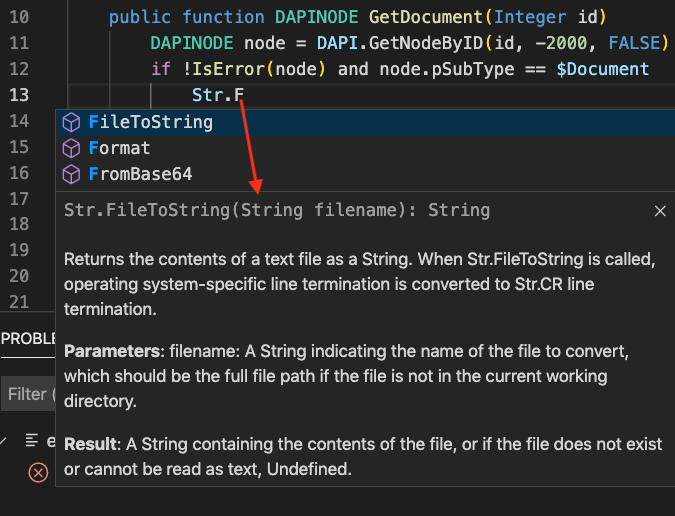

The autocompletion works currently only for the built-in global functions and object methods.

### Hints on Hover

A hint about the usage of a keyword or an identifier will be displayed when hovering the mouse cursor above it. The information is the same as for the autocompletion.

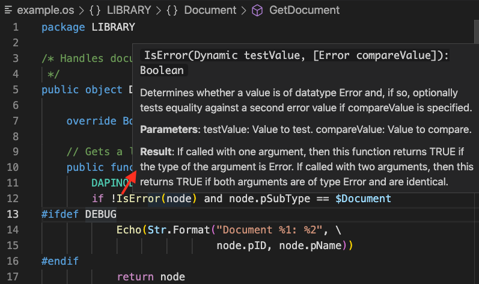

The hover hints work currently only for the built-in global functions and object methods.

### Symbol Outline

Symbols that introduce scopes to the code, like objects, functions or script are displayed in the Outline sidebar or in the document breadcrumb area to help you orientate yourself in the source file.

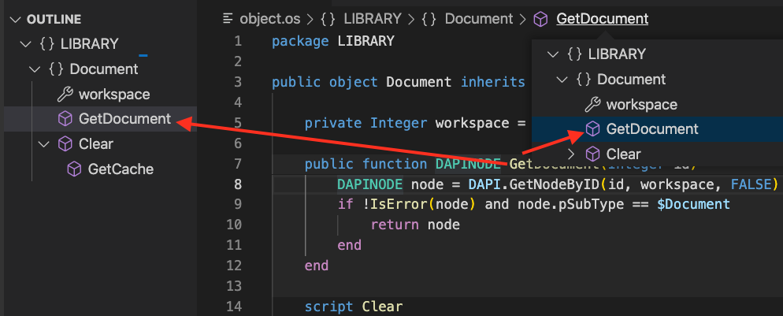

### Definition and References

You can jump to the definition of a variable or a function by the command "Go to Definition" (`F12`):

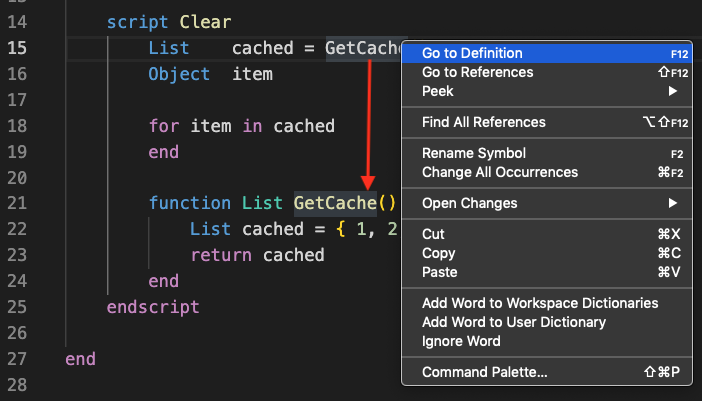

You can cycle over references of a variable or a function one-by-one by the command "Go to References" (`Shift+F12`):

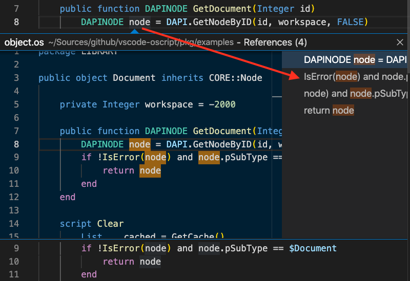

You can also list all references of a variable or a function by the command "Find All References" (`Shift+Alt+F12`):

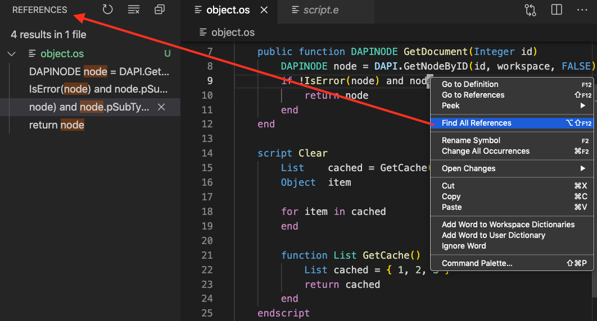

The support for definitions and references works currently only for the locally declared variables and functions.

### Renaming

You can rename a variable or a function by the command "Rename Symbol" (`F2`).

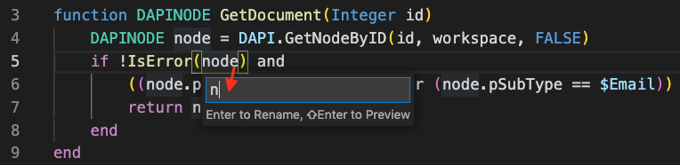

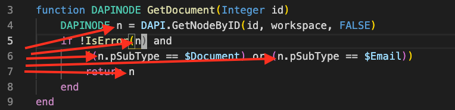

Identifier renaming works currently only for the locally declared variables and functions.

## Settings

This extension contributes the following settings. Names of the properties in table are shortened not to occupy so much space. They have to be prefixed by "oscript." to get the full name:

| Name                     | Type      | Description                             | Default   |
| ------------------------ | --------- | --------------------------------------- | --------- |
| `languageServer.enabled` | `boolean` | enable/disable the language server      | `true`    |
| `validation.enabled`     | `boolean` | enable/disable syntax validation        | `true`    |
| `completion.enabled`     | `boolean` | enable/disable typing completion        | `true`    |
| `hover.enabled`          | `boolean` | enable/disable the hover hints          | `true`    |
| `symbols.enabled`        | `boolean` | enable/disable the symbol outline       | `true`    |
| `definition.enabled`     | `boolean` | enable/disable locating definitions     | `true`    |
| `references.enabled`     | `boolean` | enable/disable finding references       | `true`    |
| `rename.enabled`         | `boolean` | enable/disable identifier renaming      | `true`    |
| `quickFixes.enabled`     | `boolean` | enable/disable quick-fixes for problems | `true`    |
| `whatIsNew.change`       | `string`  | limit the "What Is New" announcement    | `"minor"` |
| `logging.level`          | `string`  | level of console diagnostics messages   | `"error"` |

Expected values for the `oscript.whatIsNew.change` property are `"none"`, `"major"` , `"minor"` or `"patch"`. They refer to a change in the version format `major.minor.patch`.

Expected values for the `oscript.logging.level` property are `"error"`, `"warning"` or `"debug"`.

If `oscript.languageServer.enabled` is set to `false`, all features will be disabled, which need the [OScript language server].

## Planned

* Autocompletion and hover hints for user code
* Go to definition
* Renaming of other than local identifiers and files
* Snippets
* WebLingo support

## Notes

If you keep to the official OScript coding standard, use tabs and set the visual tab size to 4 in `settings.json`:

```json
"[oscript]": {
  "editor.tabSize": 4,
  "editor.insertSpaces": false,
  "editor.detectIndentation": false
}
````

## Troubleshooting

If you encounter an unexpected behaviour, inspecting the debug output may help to pinpoint the problem. Diagnostic messages can be enabled by:

```json
"oscript.logging.level": "debug"
````

If you encounter problems with features supplied by the [OScript language server], you can disable them by [boolean flags](#settings) described above. If you encounter performance problems, you can disable all features using the language server and retain just features supplied by the [static language description] like syntax highlighting:

```json
"oscript.languageServer.enabled": false
````

If you do encounter such problems, [file a bug report] about it, please. Thank you!

## Contributing

In lieu of a formal styleguide, take care to maintain the existing coding
style. Run `npm test` to validate your changes. Use the examples
in the `pkg/examples` directory to check the effect of your changes.

## Others

Users of [TextMate] can install the [OScript Bundle]. Other editors with the syntax highlighting for OScript are based on [Scintilla], for example. [SciTE], [Geany], [Nodepad++] and [others] include a [colourful theme] for the [OScript lexer].

Web pages can highlight the OScript syntax of a code example [using JavaScript].

## License

Copyright (c) 2020-2021Ferdinand Prantl

The logo was based on an [original icon](https://icon-icons.com/icon/file-type-vscode/130084) published among [vscode by Roberto Huertas](https://icon-icons.com/pack/vscode/2107) under the [Creative Commons Attribution 4.0 International (CC BY 4.0)](https://creativecommons.org/licenses/by/4.0/) license. Thank you!

Licensed under the [MIT license].

[Visual Studio Code]: https://code.visualstudio.com/
[from the marketplace]: https://marketplace.visualstudio.com/items?itemName=prantlf.vscode-oscript
[released package]: https://github.com/prantlf/vscode-oscript/releases
[OScript language]: https://github.com/prantlf/oscript-parser/blob/master/doc/grammar.md#oscript-language-grammar
[OScript language server]: ./pkg/server/#readme
[Bracket Pair Colorizer 2]: https://marketplace.visualstudio.com/items?itemName=CoenraadS.bracket-pair-colorizer-2
[static language description]: ./pkg/syntaxes/
[file a bug report]: https://github.com/prantlf/vscode-oscript/issues/new
[TextMate]: https://macromates.com/
[OScript Bundle]: https://github.com/prantlf/oscript.tmbundle
[Scintilla]: https://scintilla.org/
[SciTE]: https://www.scintilla.org/SciTE.html
[colourful theme]: https://sourceforge.net/p/scintilla/scite/ci/default/tree/src/oscript.properties
[OScript lexer]: https://sourceforge.net/p/scintilla/code/ci/default/tree/lexers/LexOScript.cxx
[Geany]: https://www.geany.org/
[Nodepad++]: https://notepad-plus-plus.org/
[others]: https://www.scintilla.org/ScintillaRelated.html
[using JavaScript]: http://prantlf.blogspot.com/2012/07/oscript-syntax-highlighting-in-pure.html
[MIT license]: ./LICENSE
