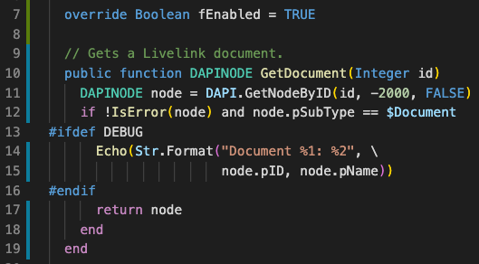
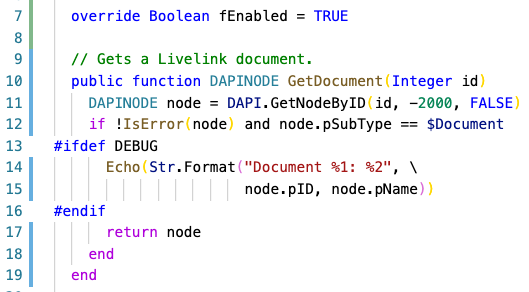

# OScript for Visual Studio Code

Provides syntax highlighting for the OScript language in Visual Studio Code. OScript is used for development with OpenText Content Server (Livelink).

## Examples

An example of the syntax highlighting in the Dark+ theme:

An example of the syntax highlighting in the Light+ theme:

## Features

* Syntax Highlighting
* Folding
* Commenting / Uncommenting

## Planned

* Linting
* IntelliSense
* Snippets

## Contributing

In lieu of a formal styleguide, take care to maintain the existing coding
style. Run `npm run vscode:prepublish` to validate your changes. Use the
examples in `test/` to check the effect of your changes.

## Others

Users of [TextMate] can install the [OScript Bundle]. Other editors with the syntax highlighting for OScript are based on [Scintilla], for example. [SciTE], [Geany], [Nodepad++] and [others] include a [colourful theme] for the [OScript lexer].

Web pages can highlight the OScript syntax of a code example [using JavaScript].

## License

Copyright (c) 2020 Ferdinand Prantl

Licensed under the [MIT license].

[TextMate]: https://macromates.com/
[OScript Bundle]: https://github.com/prantlf/oscript.tmbundle
[Scintilla]: https://scintilla.org/
[SciTE]: https://www.scintilla.org/SciTE.html
[colourful theme]: https://sourceforge.net/p/scintilla/scite/ci/default/tree/src/oscript.properties
[OScript lexer]: https://sourceforge.net/p/scintilla/code/ci/default/tree/lexers/LexOScript.cxx
[Geany]: https://www.geany.org/
[Nodepad++]: https://notepad-plus-plus.org/
[others]: https://www.scintilla.org/ScintillaRelated.html
[using JavaScript]: http://prantlf.blogspot.com/2012/07/oscript-syntax-highlighting-in-pure.html
[MIT license]: ./LICENSE
